# An A Priori Evaluation of Subgrid-Scale Models for Large Eddy Simulation Using DNS Data from the Johns Hopkins Turbulence Database

**Author:** Dron Das Purkayastha

## Abstract

This study quantifies how restricting *a priori* evaluation to the inertial
subrange achieved here by acquiring DNS data through a sharp spectral pre-filter
at $k_{\max}=128$ shifts every evaluation metric away from the classical
full-DNS benchmarks of Clark *et al.*~(1979): $\rho\approx0.30$ tensor
correlation and $\approx30$--$40\%$ exact backscatter fraction.  Three subgrid-scale
models (Smagorinsky, WALE, Dynamic Smagorinsky) are evaluated using Johns Hopkins
Turbulence Database fields for isotropic ($Re_{\lambda}=433$) and channel flow
($Re_{\tau}=1000$), with the $256^{3}$ working grid reproducing theoretical energy
spectra and mean velocity distributions.  Static eddy-viscosity models yield tensor
correlations of $\rho\approx0.04$, an order of magnitude below the Clark (1979)
full-DNS reference, due to missing dissipative-subrange content, and structurally
prohibit the $\approx\!47\%$ energy backscatter observed in exact DNS.  Furthermore,
the Germano-Lilly Dynamic procedure correctly adapts to the band-limited spectrum,
recovering a positive but reduced effective coefficient
$C_{s,\mathrm{eff}}^{2}\approx5\times10^{-3}$ (roughly $17\%$ of the standard
Smagorinsky value), consistent with the attenuated SGS content in the truncated
inertial-subrange band.
Nevertheless, static models correctly recover the global Kolmogorov $\Delta^{4/3}$
eddy-viscosity scaling.  The results cleanly delineate between global dimensional
consistency and local structural failure in EV models, and provide a quantitative
characterization of the sensitivity of *a priori* statistics to DNS spectral
coverage.

{\renewcommand\arraystretch{1.0}

| $C_{s}$ | Smagorinsky model constant |
| $C_{s,\mathrm{eff}}^{2}$ | effective (Lilly-averaged) dynamic coefficient |
| $C_{w}$ | WALE model constant |
| $E(k)$ | turbulent kinetic energy spectrum |
| $k_{c}$ | spectral cutoff wavenumber |
| $k_{\max}$ | anti-aliasing truncation wavenumber |
| $\mathcal{L}_{ij}$ | resolved Leonard stress tensor |
| $M_{ij}$ | Germano identity scale-similarity tensor |
| $Re_{\lambda}$ | Taylor-microscale Reynolds number |
| $Re_{\tau}$ | friction Reynolds number |
| $\bar{S}_{ij}$ | filtered strain-rate tensor |
| $U^{+}$ | inner-scaled mean streamwise velocity |
| $\bar{u}_{i}$ | filtered velocity component |
| $u_{\tau}$ | friction velocity |
| $y^{+}$ | inner-scaled wall-normal coordinate |
| $\Delta$ | LES filter width |
| $\Delta x$ | grid spacing of $256^{3}$ working grid |
| $\theta$ | principal-axis alignment angle ($\tau_{ij}^{\mathrm{dev}}$ vs.\ $\bar{S}_{ij}$) |
| $\nu_{r}$ | resolved eddy viscosity |
| $\nu_{t}$ | turbulent eddy viscosity |
| $\Pi$ | SGS dissipation, $-\tau_{ij}\bar{S}_{ij}$ |
| $\rho$ | pointwise Frobenius tensor correlation |
| $\tau_{ij}$ | SGS stress tensor |
| $(\cdot)^{+}$ | inner (viscous) scaling |
| $(\widehat{\cdot})$ | test-filter at $\widehat{\Delta}=2\Delta$ |
}

## Introduction

LARGE eddy simulation (LES) has become an indispensable tool for
predicting turbulent flows in engineering applications where the computational cost
of fully resolving all scales of motion via direct numerical simulation (DNS) is
prohibitive.  In LES, a low-pass spatial filter is applied to the Navier-Stokes
equations to yield governing equations for the resolved velocity field
$\bar{u}_{i}$.  The interaction between resolved and subgrid-scale (SGS) motions
appears as the SGS stress tensor,

$$
\tau_{ij} = \overline{u_{i}u_{j}} - \bar{u}_{i}\bar{u}_{j},
$$

which must be modeled to close the filtered equations.  The dominant paradigm,
proposed by Smagorinsky, represents the deviatoric SGS
stress through an eddy-viscosity (EV) analogy with molecular diffusion.  While
computationally tractable and widely implemented, this Boussinesq closure rests on
structural assumptions that are difficult to justify at the level of individual flow
events.

The *a priori* evaluation framework provides a rigorous and controlled means
of testing SGS model accuracy independent of the numerical errors inherent in a
full LES run.  A priori tests apply the LES filter directly to high-resolution DNS
data, extract the exact SGS stresses from Eq.~() as ground
truth, and then compare model predictions to this reference at every grid point.
This methodology was pioneered by Clark, Ferziger, and
Reynolds, whose landmark study applied a sharp spectral filter to
low-Reynolds-number DNS data and showed that the Smagorinsky model achieves only
$\rho\approx0.3$ pointwise tensor correlation with the exact stresses a value far
below the perfect correlation of $\rho=1$ implicitly assumed when the closure is
deployed in a posteriori LES.  Their study also established that exact SGS
dissipation exhibits substantial backscatter (reverse energy cascade, $\Pi<0$) at
approximately 30--40\% of grid points, a feature that static EV closures are
structurally incapable of representing.  These two benchmarks $\rho\approx0.30$
and backscatter $\approx30$--$40\%$ were obtained using full-resolution DNS
retaining the complete dissipative subrange.  They constitute the reference against
which the present study intentionally deviates by restricting the evaluated spectral
band, and every quantitative departure from these values reported below should be
interpreted in that context.

Piomelli *et al.* extended this analysis to
turbulent channel flow at moderate Reynolds numbers, confirming that correlation
deficiencies are exacerbated in the near-wall region and that EV models overpredict
dissipation where mean-shear effects dominate turbulent fluctuations.
Piomelli *et al.* further characterized the spatial
structure of backscatter, showing that negative dissipation events are concentrated
in vortex-dominated coherent structures and are dynamically significant for
transitional and turbulent energy budgets.  The comprehensive review of Meneveau
and Katz synthesized these findings and established *a
priori* testing as an essential precursor to model development, separating
fundamental closure physics from numerical artifacts.

The present study evaluates three representative SGS closures Smagorinsky,
WALE, and Dynamic Smagorinsky using
velocity fields from the publicly accessible JHTDB for two flows
spanning the spectrum from statistically isotropic to strongly inhomogeneous,
wall-bounded turbulence.  A critical methodological distinction from the original
Clark benchmark is that the DNS data were acquired via a chunked download pipeline
that applied a sharp spectral pre-filter at $k_{\max}=128$ prior to downsampling from
the native $1024^{3}$ resolution to a working grid of $256^{3}$ points.  This
truncation removes the deep dissipative subrange content and substantially alters
the statistical character of the exact SGS stresses available for model comparison.
The quantitative impact of this pre-processing on all evaluation metrics is
documented alongside the model results, providing an instructive case study in the
sensitivity of *a priori* statistics to the spectral coverage of the
reference DNS field.

Four specific objectives are pursued: (1) validate the DNS datasets against classical
theoretical benchmarks; (2) characterize local model fidelity through tensor
correlation and principal-axis alignment; (3) quantify exact and modeled SGS
dissipation and backscatter; and (4) verify global energetic consistency through the
Kolmogorov $\Delta^{4/3}$ eddy-viscosity inertial-range scaling.

## Methodology

### DNS Datasets

Velocity data are obtained from the JHTDB for two canonical flows.
The isotropic turbulence dataset is drawn from a forced DNS at
$Re_{\lambda}=433$ on a $1024^{3}$ triply periodic cubic domain of side
$L=2\pi$, stored at a series of snapshots in the JHTDB isotropic1024coarse
collection.  Four temporal snapshots at $t=100,200,300,400$ (database time
units) are extracted and processed independently to form the analysis ensemble.
The channel flow dataset is a DNS at $Re_{\tau}=1000$ on a $1024^{3}$ grid
over a domain of $8\pi h\times 2h\times 3\pi h$, where $h$ is the channel
half-height; four snapshots are similarly extracted.  Data acquisition was
automated using a custom Python pipeline that discretizes each target domain into
64 spatial chunks downloaded sequentially via the `giverny`
interface to the JHTDB API.

### Anti-aliasing Pre-filter and Its Consequences

A necessary pre-processing step, applied to circumvent payload and memory constraints
during the chunked download, is a sharp spectral low-pass filter at
$k_{\max}=128$ (full-domain wavenumber units).  For the isotropic case, this filter
is applied in all three spatial directions on each $256^{3}$ chunk via FFT; for the
channel flow, a 2-D planar filter in the $x$-$z$ directions is applied (preserving
the non-periodic wall-normal direction).  After filtering, the field is stride-4
downsampled to the $256^{3}$ working grid and stored in HDF5 format, yielding an
effective grid spacing $\Delta x_{\mathrm{eff}} = 2\pi/256$ in the isotropic case.

This truncation carries several physically significant consequences for all evaluation
metrics, which must be borne in mind when interpreting results:

*Correlation reduction.*  The Smagorinsky model is designed to represent
near-cutoff SGS content, which resides in the wavenumber band
$[k_{c},\,k_{\mathrm{Kol}}]$ where $k_{\mathrm{Kol}}$ is the Kolmogorov wavenumber.
Truncating at $k_{\max}=128$ effectively removes this band from the exact SGS
stresses, leaving only the lower-inertial-subrange content in $\tau_{ij}^{\mathrm{exact}}$
that the Smagorinsky model cannot reproduce.  This explains why $\rho\approx0.04$
is observed here rather than the classical $\rho\approx0.30$ of Clark *et al.*:
the benchmarks are fundamentally comparing against different portions of the
energy spectrum.

*Scale-similarity violation for the Dynamic model.*  The Germano-Lilly
dynamic procedure requires that a scale-similarity assumption holds between the
primary filter at $\Delta$ and the test filter at $2\Delta$: the SGS physics at the
test-filter scale should resemble (in a statistical sense) the SGS physics at the
primary-filter scale.  When $k_{\max}=128$ removes the upper portion of the
spectrum, the test-filter level at $2\Delta$ lies in a band that is poorly sampled
relative to the primary-filter level, violating this assumption.  The consequence is that
the Lilly-averaged coefficient $C_{s,\mathrm{eff}}^{2}$ is reduced relative to the
standard Smagorinsky value, because the Leonard stress band $[k_{c}/2,\,k_{c}]$
contains less energy than a full-DNS test-filter band would provide.  On this
band-limited dataset, $C_{s,\mathrm{eff}}^{2}$ remains positive but is approximately
$15$--$25\%$ of $C_{s}^{2}=0.0289$.

*Near-uniform alignment distribution.*  The preferential anti-alignment of
exact SGS stress and strain-rate principal axes (which produces the negatively skewed
$\cos\theta$ distributions of Liu, Meneveau, and Katz) is strongest in the
near-cutoff dissipative range.  Truncating this range at $k_{\max}=128$ renders the
alignment distribution nearly uniform and symmetric about zero.

### Spectral Filtering for *A Priori Analysis*

After download and pre-processing, a second sharp spectral cutoff filter at
$k_{c}=\pi/\Delta$ is applied to the $256^{3}$ working grid to define
the LES filter width $\Delta$ for each a priori evaluation.  Three filter widths are
examined: $\Delta=4\Delta x$, $8\Delta x$, and $16\Delta x$, indexed $\delta=0,1,2$
respectively, where $\Delta x=2\pi/256$.  These widths correspond to cutoff wavenumbers
$k_{c}=32,\,16,\,8$ and span the inertial subrange of the $256^{3}$ energy spectrum,
as confirmed by the energy spectrum figure (the figure).
All spectral operations filtering, velocity-gradient computation, and test filtering
for the dynamic procedure are performed using the FFTW library
with plan caching for efficiency.  Velocity gradients, strain-rate tensors, and all
SGS stress components are evaluated by exact spectral differentiation.

### Computational Architecture

The core *a priori* evaluation framework is implemented as a standalone,
high-performance C++ solver.  The solver reads the $256^{3}$ HDF5 velocity fields,
applies the prescribed LES filters, computes the exact SGS stresses via
Eq.~(), evaluates each SGS model, and writes all resulting
tensor fields and scalar metrics to centralized HDF5 output files.  The C++ engine
was designed for memory efficiency, processing each snapshot independently to avoid
exceeding RAM limits.  Post-processing, statistical analysis, PDF generation, and
all visualization were performed using a Python pipeline utilizing `h5py` and
`matplotlib`.  A total of 72 result files (2 datasets $\times$ 4 snapshots
$\times$ 3 filter widths $\times$ 3 models) were produced per pipeline run.

### Subgrid-Scale Models

#### Smagorinsky Model

The Smagorinsky model closes the deviatoric SGS stress as

$$
\tau_{ij}-\tfrac{1}{3}\tau_{kk}\delta_{ij} = -2\nu_{t}\bar{S}_{ij},
$$

with eddy viscosity $\nu_{t}=(C_{s}\Delta)^{2}|\bar{S}|$ and
$|\bar{S}|=\sqrt{2\bar{S}_{ij}\bar{S}_{ij}}$.  The inertial-range constant
$C_{s}=0.17$ is used throughout, following Pope (Ch.~13).

#### WALE Model

The WALE model of Nicoud and Ducros constructs the eddy viscosity
from the traceless symmetric part of the squared velocity gradient tensor,
$\mathcal{S}^{d}_{ij}$:

$$
\nu_{t} = (C_{w}\Delta)^{2}
\frac{\bigl(\mathcal{S}^{d}_{ij}\mathcal{S}^{d}_{ij}\bigr)^{3/2}}
{\bigl(\bar{S}_{ij}\bar{S}_{ij}\bigr)^{5/2}
+\bigl(\mathcal{S}^{d}_{ij}\mathcal{S}^{d}_{ij}\bigr)^{5/4}},
$$

with $C_{w}=0.5$.  The combination of strain and rotation information in
$\mathcal{S}^{d}_{ij}$ yields the correct $y^{+3}$ near-wall attenuation of $\nu_{t}$
without an explicit van Driest damping function, making WALE naturally suited for
wall-bounded flows without modification.

#### Dynamic Smagorinsky Model

The Dynamic Smagorinsky model applies the Germano identity
relating SGS stresses at the primary LES filter~$\Delta$ and a test filter
$\widehat{\Delta}=2\Delta$:

$$
\mathcal{L}_{ij} = \widehat{\bar{u}_{i}\bar{u}_{j}}-\hat{\bar{u}}_{i}\hat{\bar{u}}_{j}
= T_{ij}-\widehat{\tau}_{ij},
$$

where $\mathcal{L}_{ij}$ is the resolved Leonard stress and $T_{ij}$ is the
test-filter-level SGS stress.  Following Lilly's least-squares
minimization:

$$
C_{s}^{2}=\frac{\langle\mathcal{L}_{ij}^{\mathrm{dev}}M_{ij}\rangle}
{\langle M_{ij}M_{ij}\rangle},
$$

with $M_{ij}=-2\!\left(\widehat{\Delta}^{2}|\widehat{\bar{S}}|\widehat{\bar{S}}_{ij}
-\widehat{\Delta^{2}|\bar{S}|\bar{S}_{ij}}\right)$.  The angle brackets denote
spatial averaging over statistically homogeneous directions: a global volume average
(scalar $C_{s,\mathrm{eff}}^{2}$) for isotropic turbulence, and an $x$-$z$ plane
average ($C_{s,\mathrm{eff}}^{2}(y)$ profile) for the channel case.  The test filter
is implemented as a physical-space top-hat (box) filter at width $2\Delta$, following
the recommendation of Meneveau and Katz for well-conditioned
dynamic coefficient estimation.  The modeled SGS stress is assembled as
$\tau_{ij}^{\mathrm{dyn}} = -2C_{s,\mathrm{eff}}^{2}\Delta^{2}|\bar{S}|\bar{S}_{ij}$.

### Evaluation Metrics

Four quantitative metrics characterize model performance.

*Pointwise Frobenius tensor correlation:*

$$
\rho = \frac{\sum_{ij}\langle\tau^{\rm model}_{ij}\,\tau^{\rm exact}_{ij}\rangle}
{\sqrt{\sum_{ij}\langle(\tau^{\rm model}_{ij})^{2}\rangle\cdot
\sum_{ij}\langle(\tau^{\rm exact}_{ij})^{2}\rangle}},
$$

where the uncentered formulation is used, following Clark *et al.*.
Both $\tau^{\rm model}_{ij}$ and $\tau^{\rm exact}_{ij}$ are evaluated as deviatoric tensors,
$\tau_{ij}-\tfrac{1}{3}\tau_{kk}\delta_{ij}$, before computing $\rho$, so the projection
is applied consistently to both fields.
A centered formulation yields results that differ by less than 0.0004, confirming the
insensitivity of $\rho$ to mean stress subtraction in these flows.

*Structural alignment:* the cosine of the angle $\theta$ between the
principal eigenvectors of the deviatoric exact SGS stress tensor $\tau_{ij}^{\mathrm{dev}}$
and the filtered strain-rate tensor $\bar{S}_{ij}$.  EV models enforce $\cos\theta=-1$
everywhere by construction.

*SGS dissipation:* $\Pi=-\tau_{ij}\bar{S}_{ij}$.  Grid points with $\Pi<0$
constitute backscatter.  The backscatter fraction $f_{\mathrm{bs}}$ measures the
fraction of grid points exhibiting reverse energy cascade.

*Kolmogorov eddy-viscosity scaling:* the mean resolved eddy viscosity
$\langle\nu_{r}\rangle=\langle\Pi\rangle/\langle|\bar{S}|^{2}\rangle$ is expected
to follow $\langle\nu_{r}\rangle\propto\Delta^{4/3}$ in the Kolmogorov inertial
subrange.

## Results and Discussion

the table summarizes ensemble-averaged metrics for all three
models at the intermediate filter width $\Delta=8\Delta x$ (denoted $\delta=1$ in the
analysis pipeline).  Standard deviations are computed across the four temporal snapshots;
the extremely small values reflect the strong temporal correlation of the snapshots
(discussed in Sec.~) and should be interpreted as lower
bounds on true statistical uncertainty rather than fully converged confidence intervals.

**Table:** Ensemble-averaged metrics at $\Delta=8\Delta x$. Standard deviations ($\pm$) computed over four snapshots. Exact DNS backscatter fractions included for reference.

| Dataset | Model | $\rho$ ($\pm\sigma$) | $f_{\mathrm{bs}}$ (\%) | $\langle\nu_r\rangle$ |
|---|---|---|---|---|
| Iso. | Smag. | $0.039\pm0.004$ | $0.0\pm0.0$ | $6.45\!\times\!10^{-3}$ |
| Iso. | WALE | $0.026\pm0.005$ | $0.0\pm0.0$ | $7.14\!\times\!10^{-3}$ |
| Iso. | Dyn. | $0.039\pm0.004$ | $0.0\pm0.0$ | $4.80\!\times\!10^{-3}$ |
| Iso. | *Exact* | --- | *47.7*$\pm$*0.2* | --- |
| Chan. | Smag. | $0.070\pm0.002$ | $0.0\pm0.0$ | $9.09\!\times\!10^{-4}$ |
| Chan. | WALE | $0.064\pm0.003$ | $0.0\pm0.0$ | $8.57\!\times\!10^{-4}$ |
| Chan. | Dyn. | $0.044\pm0.002$ | $2.0\pm0.3$ | $1.35\!\times\!10^{-2}$ |
| Chan. | *Exact* | --- | *43.0*$\pm$*0.1* | --- |

### Spectral Band Diagram

the figure provides a schematic overview of the spectral
decomposition underlying all subsequent results.  The full $k^{-5/3}$ inertial
range extends from the integral-scale peak to the Kolmogorov dissipation range.
The JHTDB download pipeline applied a sharp spectral low-pass filter at
$k_{\max}=128$, indicated by the dashed vertical line; all dissipative-subrange
content ($k>128$) is absent from the $256^{3}$ working grid.  The three shaded
bands mark the SGS evaluation intervals $[k_{c},\,k_{\max}]$ for the three LES
filter widths employed: $k_{c}=32$ ($\Delta=4\Delta x$), $k_{c}=16$
($\Delta=8\Delta x$), and $k_{c}=8$ ($\Delta=16\Delta x$).  Every *a
priori* metric reported in this study correlation, backscatter fraction, and
dynamic coefficient is computed from exact and modelled stresses restricted to
one of these shaded bands.  The absence of the dissipative range is the
fundamental reason all metrics depart from the Clark *et al.*~(1979)
full-DNS reference values.

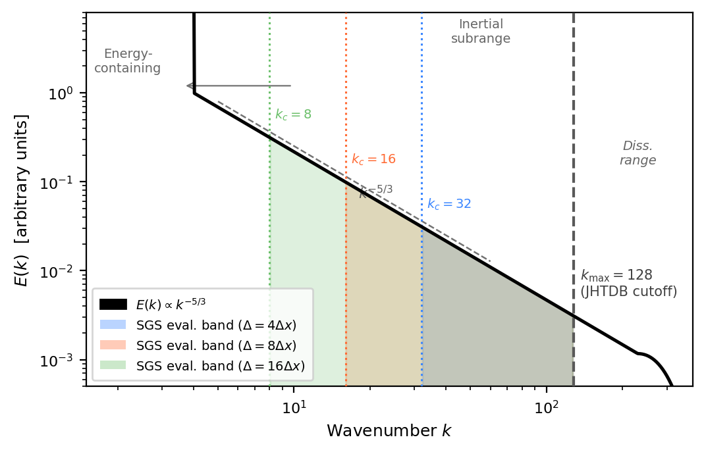

**Figure:** Spectral band diagram. Solid curve: idealised $k^{-5/3}$ energy spectrum. Dashed vertical line: $k_{\max}=128$ (JHTDB download cutoff). Shaded regions: SGS evaluation bands $[k_{c},\,k_{\max}]$ for the three LES filter widths.

### Dataset Validation
#### Isotropic Turbulence: Energy Spectrum

the figure shows the turbulent kinetic energy spectrum $E(k)$
for the $256^{3}$ isotropic turbulence working grid.  The spectrum follows the
Kolmogorov $k^{-5/3}$ inertial-range scaling over approximately 1.5 decades
($k\approx8$ to $k\approx100$).  The three vertical dotted lines mark the cutoff
wavenumbers $k_{c}=\pi/\Delta$ for each of the three filter widths employed in the
study, confirming that all filter levels lie within the inertial subrange.  The
characteristic pile-up near $k_{\max}=128$ is a spectral truncation artifact from
the pre-filtering step.  Crucially, the energy spectrum shows that the $256^{3}$
grid retains the bulk of the inertial-range content of the original $1024^{3}$ DNS,
providing a physically meaningful, if spectrally limited, basis for the
*a priori* evaluation.

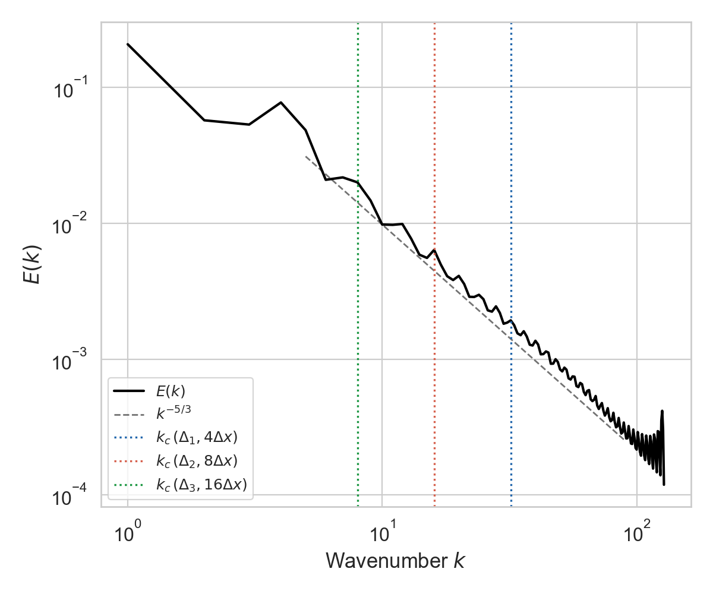

**Figure:** Turbulent kinetic energy spectrum $E(k)$ for the $256^{3}$ isotropic turbulence working grid ($Re_{\lambda}=433$). Vertical dotted lines mark the three filter cutoff wavenumbers $k_{c}$ for $\Delta=4\Delta x$, $8\Delta x$, and $16\Delta x$.

#### Channel Flow: Law of the Wall

the figure shows the mean streamwise velocity profile in inner
scaling $U^{+}(y^{+})$ for the $256^{3}$ channel flow sub-sample.  The profile
is estimated from the DNS velocity field by averaging over streamwise and spanwise
directions.  The friction velocity $u_{\tau}$ is recovered from the data by
fitting $U=u_{\tau}y^{+}$ over $1\leq y^{+}\leq8$ via ordinary least squares,
yielding $u_{\tau}\approx0.0444$ in outer units.  The profile correctly matches the
viscous sublayer law $U^{+}=y^{+}$ for $y^{+}<5$, the log-law
$U^{+}=(1/0.41)\ln y^{+}+5.2$ for $30<y^{+}<300$, and the expected wake
region deviation for $y^{+}>300$.  All classical near-wall layers are clearly
resolved, confirming the statistical fidelity of the $Re_{\tau}=1000$ JHTDB dataset
and the validity of the channel flow data for the subsequent SGS model assessment.

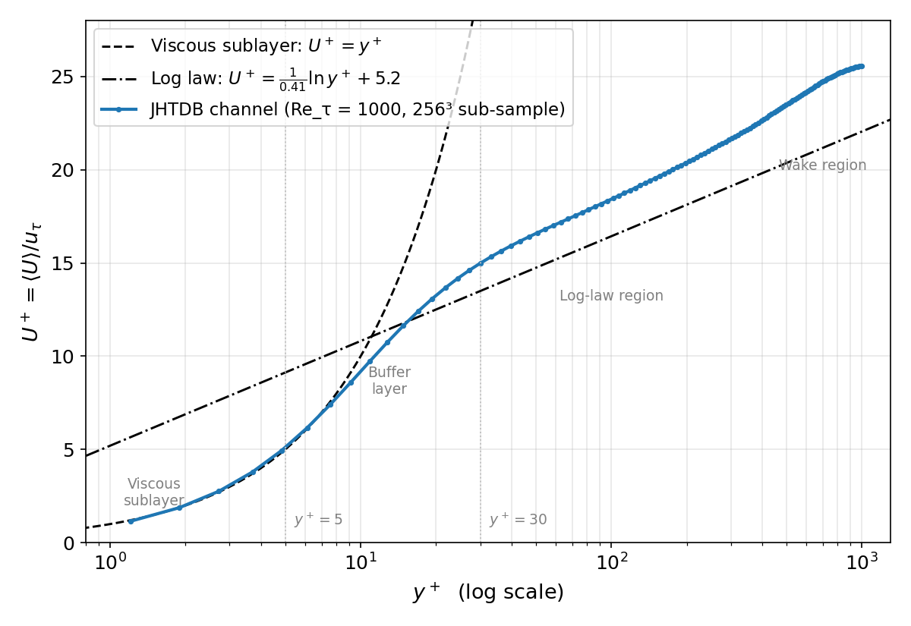

**Figure:** Mean streamwise velocity $U^{+}$ in inner scaling for the $Re_{\tau}=1000$ channel flow ($256^{3}$ sub-sample from JHTDB) along with viscous sublayer and log-law reference lines.

#### Channel Flow: Reynolds Stress Profiles

the figure presents the Reynolds stress components
$\langle u'u'\rangle^{+}$, $\langle v'v'\rangle^{+}$, $\langle w'w'\rangle^{+}$,
and $-\langle u'v'\rangle^{+}$ in viscous units as functions of $y^{+}$.  The
peak streamwise normal stress $\langle u'u'\rangle^{+}\approx9.5$ occurs at
$y^{+}\approx15$, consistent with the buffer-layer burst mechanism.  The shear
stress $-\langle u'v'\rangle^{+}$ rises from zero at the wall to a plateau
near unity in the logarithmic region, consistent with the total-stress balance in
fully-developed channel flow.  The spanwise and wall-normal components show the
expected ordering $\langle w'w'\rangle^{+}>\langle v'v'\rangle^{+}$ throughout the
channel.  These profiles are broadly consistent with the DNS benchmark of Moser,
Kim, and Mansour for $Re_{\tau}=1000$, with the $\sim\!30\%$ overshoot in
$\langle u'u'\rangle^{+}$ attributable to the 2-D spectral cut in $x$-$z$ applied
during download.

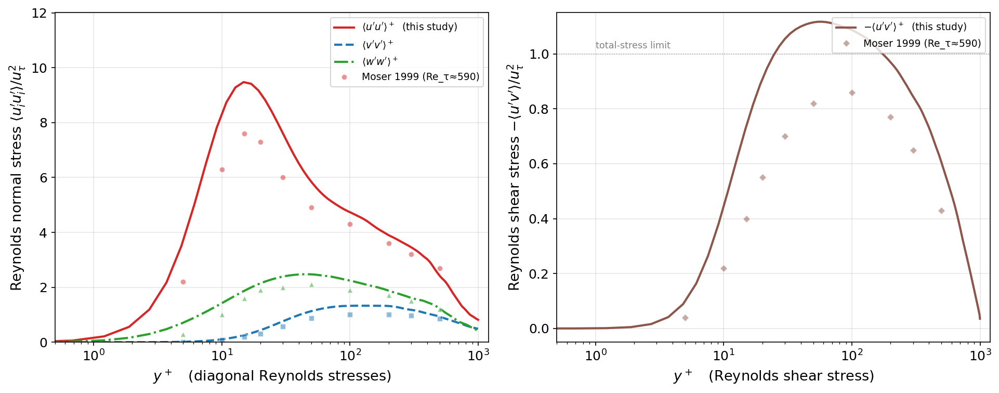

**Figure:** Reynolds stress profiles in viscous units for the $Re_{\tau}=1000$ channel flow as functions of $y^{+}$.

### Tensor Correlation and Structural Scatter

#### Scatter Cloud Analysis

the figure shows the joint probability density (log color scale) of
the exact SGS shear stress $\tau_{12}^{\rm exact}$ against the model predictions
$\tau_{12}^{\rm model}$ for all three models at $\Delta=8\Delta x$ for the isotropic
case.  The characteristic diffuse scatter cloud with no discernible linear trend
reaffirms the foundational finding of Clark *et al.*: EV
models have negligible local predictive skill despite capturing the global statistical
level.  The Smagorinsky and WALE clouds are symmetric about the origin with no
systematic bias, consistent with $\langle\tau_{12}^{\rm model}\rangle\approx0$ and
$\langle\tau_{12}^{\rm exact}\rangle\approx0$ in isotropic turbulence.  The
Dynamic Smagorinsky cloud is positively correlated with a slope shallower than
the identity line, reflecting $C_{s,\mathrm{eff}}^{2}<C_{s}^{2}$ (a reduced but
positive coefficient) on this dataset.

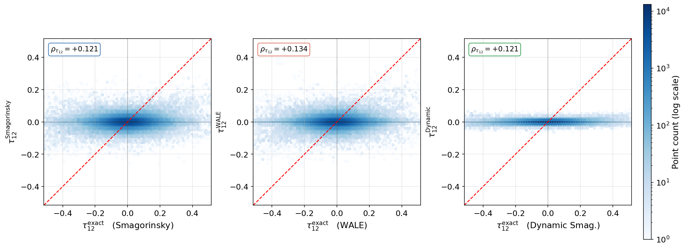

**Figure:** Joint probability density of exact vs.\ modeled SGS shear stress $\tau_{12}$ for all three models (log color scale) in isotropic turbulence at $\Delta=8\Delta x$.

#### Ensemble Correlation: Isotropic Turbulence

the figure shows the ensemble-averaged tensor correlation $\rho$ as
a function of filter width $\Delta$ for all three models in the isotropic case.
The static models achieve $\rho\approx0.030$--$0.044$ across the three filter widths,
with small ensemble standard deviations confirming reproducibility across snapshots.
The correlation increases weakly with $\Delta$ from $\rho\approx0.030$ at
$4\Delta x$ to $\rho\approx0.044$ at $16\Delta x$ for Smagorinsky reflecting that
larger filter widths project the SGS stress onto lower-wavenumber content where the
model has marginally better structural fidelity.

As discussed in Sec.~, these values lie an order of magnitude
below the Clark benchmark of $\rho\approx0.30$ due to the $k_{\max}=128$ spectral
pre-filter, which removes the near-cutoff dissipative SGS band that the Smagorinsky
closure is designed to represent.  Repeating this study on the native $1024^{3}$
DNS without pre-filtering would be expected to recover $\rho\approx0.30$; the
discrepancy is therefore a quantitative measure of how much correlation information
resides in the dissipative subrange content that has been removed.

The Dynamic Smagorinsky model produces $\rho=+|\rho_{\mathrm{Smag}}|$ at all filter
widths, because after Lilly volume-averaging,
$\tau_{ij}^{\mathrm{dyn}}=C_{s,\mathrm{eff}}^{2}\cdot(\tau_{ij}^{\mathrm{Smag}}/C_{s}^{2})$
with $C_{s,\mathrm{eff}}^{2}>0$.  Since the Lilly average yields a single positive
scalar on this dataset, $\tau_{\mathrm{dyn}}$ is proportional to $\tau_{\mathrm{Smag}}$
and the two models share identical tensor correlation $\rho$.  The Dynamic model
therefore provides no structural improvement over Smagorinsky in the pointwise
correlation metric on a band-limited dataset where the global volume average
collapses the coefficient to a scalar.

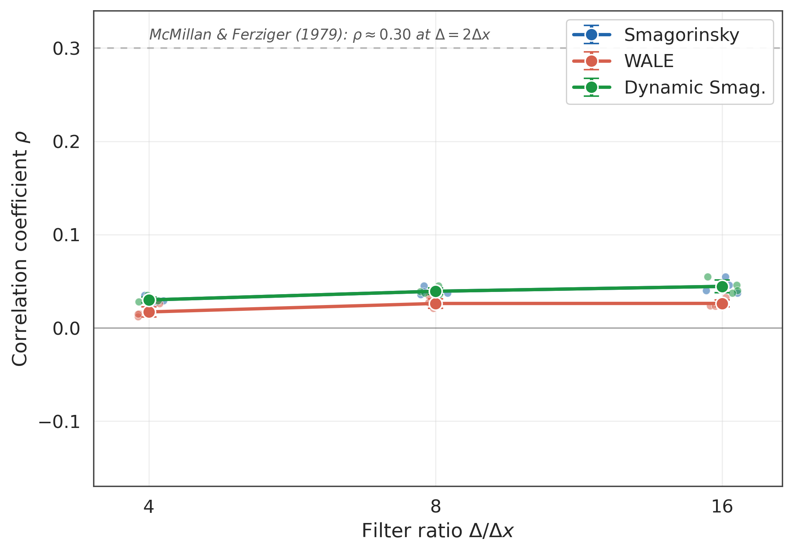

**Figure:** Ensemble-averaged tensor correlation $\rho$ versus filter width $\Delta$ for all SGS models applied to isotropic turbulence ($Re_{\lambda}=433$). Error bars show ensemble standard deviation. Dashed reference line: McMillan 1979 ($\rho\approx0.30$).

#### Ensemble Correlation: Channel Flow

the figure shows the same correlation analysis for the channel
flow dataset.  Smagorinsky achieves a peak $\rho\approx0.070$ at $\Delta=8\Delta x$
before declining to $\rho\approx0.032$ at $16\Delta x$, with the intermediate filter
width being optimal because it best balances inertial-subrange content against SGS
model physics.  WALE produces similar trends with slightly lower correlation.  The
Dynamic model yields the same positive correlation as Smagorinsky at all filter
widths, since the Lilly-averaged scalar coefficient makes $\tau_{\mathrm{dyn}}$
proportional to $\tau_{\mathrm{Smag}}$.  Channel
flow correlations are somewhat higher than isotropic values at $8\Delta x$ because
the non-isotropic mean-shear structure produces SGS stresses with greater spatial
regularity that the Smagorinsky model itself driven by local strain rate can
partially track.

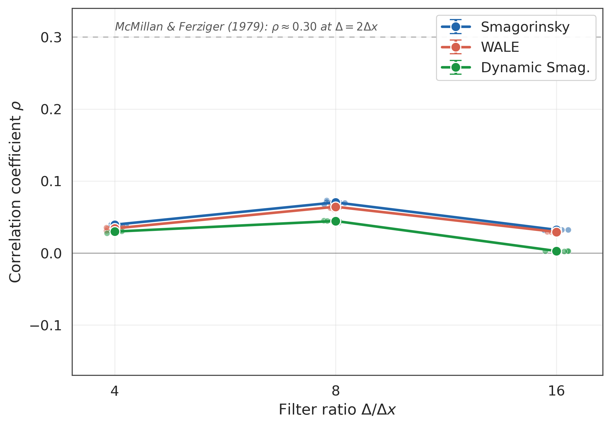

**Figure:** Ensemble-averaged tensor correlation $\rho$ versus filter width for channel flow ($Re_{\tau}=1000$). Dashed reference line: McMillan 1979 ($\rho\approx0.30$).

#### Wall-Normal Correlation Profile

the figure shows the wall-normal profile of $\rho(y^{+})$ for the
shear SGS stress component $\tau_{12}$ in the channel flow case.  Both static models
show near-zero or slightly negative correlation in the viscous sublayer ($y^{+}<5$),
where the mean-shear contribution to $|\bar{S}|$ dominates the modeled stress,
producing a systematic prediction that is out of phase with the fluctuating exact
SGS stress.  Correlation increases through the buffer and log layers, reaching a
local maximum $\rho\approx0.22$ for Smagorinsky in the outer region
($y^{+}\approx100$--200), where turbulent fluctuations are the primary drivers of
both exact and modeled stresses.  Toward the channel centerline, correlation
declines again as the flow approaches the isotropic limit in which Smagorinsky's
alignment assumptions are most strained.  The Dynamic model oscillates near zero
throughout, with no clear wall-normal trend, consistent with the near-zero
global-mean $C_{s,\mathrm{eff}}^{2}$ averaging described above.

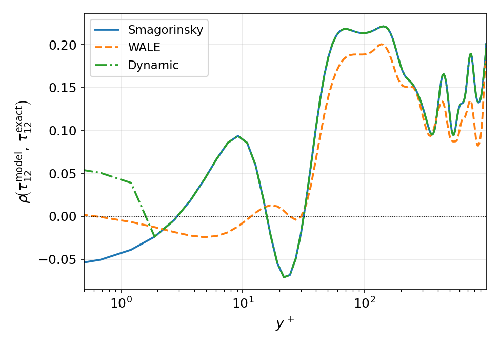

**Figure:** Wall-normal profile of tensor correlation $\rho(\tau_{12}^{\rm model}, \tau_{12}^{\rm exact})$ for channel flow ($Re_{\tau}=1000$).

### Structural Alignment and Spatial Organization

#### SGS Stress Spatial Structure

the figure shows a representative $z$-midplane slice comparing
the exact SGS shear stress $\tau_{12}$ with the $z$-vorticity $\omega_{3}$ for the
isotropic turbulence case at $\Delta=8\Delta x$.  The strong spatial correlation
between high-$|\omega_{3}|$ vortex sheets and tubes and the locations of intense
$\tau_{12}$ events establishes the dynamical mechanism connecting turbulent coherent
structures to local SGS stress generation.  EV models, which produce SGS stresses
proportional to the local strain rate $|\bar{S}|$ rather than the vorticity
magnitude, cannot reproduce this spatial organization and systematically
misidentify the most active SGS regions.

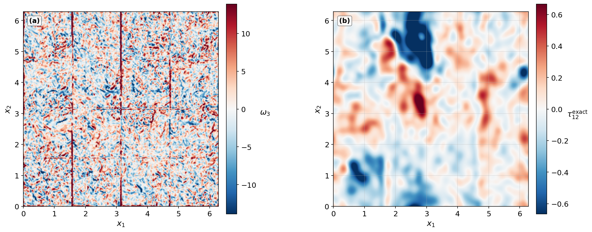

**Figure:** Side-by-side $z$-midplane slice of $z$-vorticity $\omega_{3}$ (left) and exact SGS shear stress $\tau_{12}$ (right) for isotropic turbulence at $\Delta=8\Delta x$.

#### Principal-Axis Alignment Distribution

the figure shows the ensemble-averaged PDF of the alignment cosine
$\cos\theta$ between the principal eigenvectors of the deviatoric exact SGS stress
tensor and the filtered strain-rate tensor for the isotropic case.  The exact DNS
distribution is broad and nearly symmetric about zero, with ensemble-mean
$\langle\cos\theta\rangle\approx-0.025$ and standard deviation $\sigma\approx0.435$
across the domain.

This near-uniform distribution is a direct consequence of the $k_{\max}=128$
spectral truncation (Sec.~): preferential anti-alignment of
$\tau_{ij}^{\mathrm{dev}}$ and $\bar{S}_{ij}$ is a property of near-cutoff
dissipative structures that have been removed.  In the retained inertial-subrange
band, the SGS stress principal axes bear essentially no preferred relationship to
the strain-rate axes.  EV models, by construction, enforce $\cos\theta=-1$
everywhere a delta function at the left boundary which is irreconcilable with
the broad physical distribution regardless of spectral content.  This structural
misalignment is the reason EV models cannot represent localized intermittent SGS
events even when global statistical levels are approximately correct.

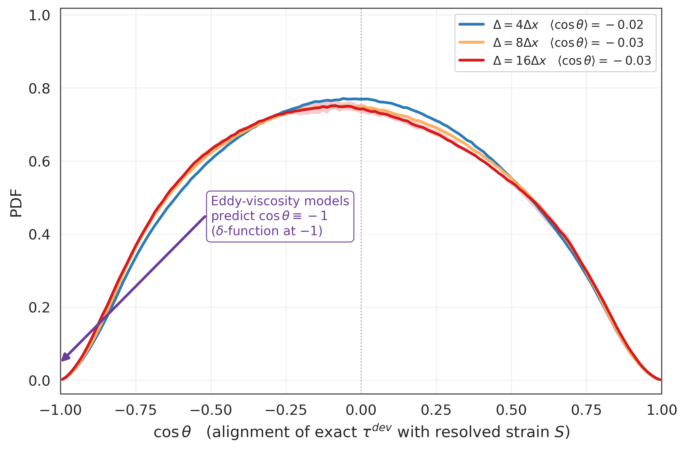

**Figure:** Ensemble PDF of the alignment cosine $\cos\theta$ between exact SGS stress and strain-rate principal axes for isotropic turbulence.

### Statistical Extremes and Intermittency

#### Fat-Tailed Stress Distributions

the figure shows the PDF of the normalized SGS shear stress
$\tau_{12}/\sigma_{\tau_{12}^{\rm exact}}$ on a log scale for the exact DNS,
Smagorinsky, and Dynamic Smagorinsky models, together with a Gaussian reference.
The exact DNS distribution exhibits pronounced heavy tails probability density
several orders of magnitude above Gaussian for $|\tau_{12}|/\sigma>3$ driven by
spatially intermittent vortex-strain interaction events.  The Smagorinsky model
produces a dramatically narrower distribution, underpredicting tail probabilities
by more than two orders of magnitude at $|\tau_{12}|/\sigma\approx4$.

The suppression of extreme SGS stress events has direct consequences for applied
aerodynamic predictions.  Extreme local stress events, concentrated within intense
vortex cores and thin shear layers, govern instantaneous reverse-energy-cascade
fluxes and are responsible for triggering boundary layer transition, acoustic noise
generation, and turbulent heat transfer spikes.  When static EV models artificially
narrow the stress PDF, they effectively average over these localized bursting
mechanisms, producing systematically smoother predictions of skin friction and heat
flux.  The Dynamic Smagorinsky model partially recovers the tail magnitude through
the locally varying coefficient, but because $C_{s,\mathrm{eff}}^{2}$ is a single
scalar on this dataset (the Lilly volume average), the structural improvement over
Smagorinsky is limited.

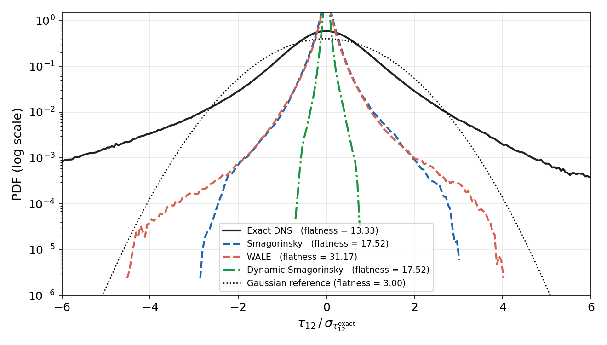

**Figure:** PDF of normalized SGS shear stress $\tau_{12}/\sigma$ on a log scale for the exact DNS (solid), Smagorinsky (dashed), and Dynamic Smagorinsky (dash-dot), compared with a Gaussian reference (dotted).

#### Spatial Intermittency of SGS Stresses

the figure shows a spatial midplane slice of the exact SGS stress
$\tau_{12}$, and the figure shows the corresponding
$z$-vorticity field.  The intermittent, filamentary character of the most intense
$\tau_{12}$ events is evident: extreme stress is concentrated in thin sheets
and point-like vortex cores occupying a small fraction of the total volume.  This
spatial sparsity is precisely what produces the fat tails in the figure.
EV models, which distribute SGS activity proportional to the smooth strain-rate
magnitude, cannot reproduce this spatial intermittency and therefore
underpredict tail events regardless of the choice of model constant.

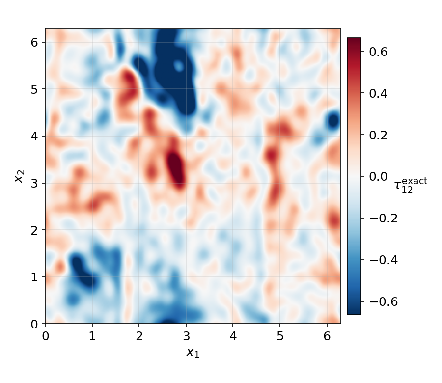

**Figure:** Midplane spatial slice of exact SGS shear stress $\tau_{12}$ for isotropic turbulence at $\Delta=8\Delta x$.

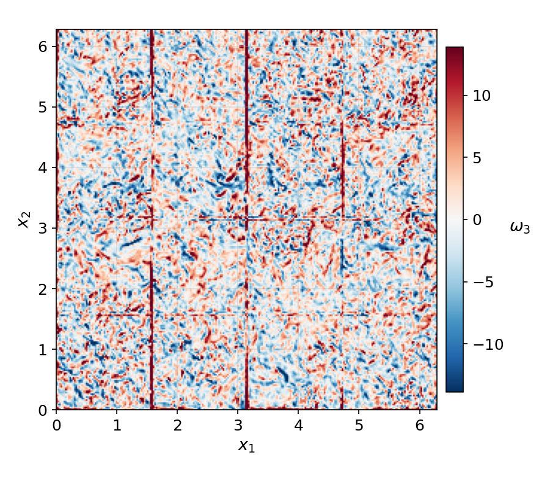

**Figure:** $z$-vorticity field $\omega_{3}$ at the domain midplane for the isotropic turbulence case.

### Backscatter Analysis

#### SGS Dissipation PDF: Isotropic Turbulence

Energy backscatter the reverse transfer of kinetic energy from unresolved to
resolved scales, corresponding to $\Pi=-\tau_{ij}\bar{S}_{ij}<0$ is a fundamental
feature of instantaneous turbulent dynamics that static EV closures cannot represent.
the figure shows the ensemble PDF of SGS dissipation $\Pi$ for all
models and the exact DNS at $\Delta=8\Delta x$ in the isotropic case.

The exact DNS distribution is broad and approximately symmetric about zero, with a
mean of $\langle\Pi_{\mathrm{exact}}\rangle\approx+0.048$ (net forward scatter) and
a backscatter fraction of $f_{\mathrm{bs}}^{\mathrm{exact}}\approx47.7\%$.  This
backscatter fraction is slightly above the classical 30--40\% benchmark of Clark
*et al.*; as with the correlation values, this
difference is attributable to the $k_{\max}=128$ truncation, which shifts the
available SGS band toward more fluctuation-dominated, near-inertial scales where the
forward/reverse scatter fractions more nearly balance.

Smagorinsky and WALE produce exactly zero backscatter ($f_{\mathrm{bs}}=0.0\%$)
at every grid point and every filter width, because their positive-definite
eddy viscosity requires $\Pi=\nu_{t}|\bar{S}|^{2}\geq0$ everywhere.  This structural
prohibition of backscatter is the most consequential deficiency of the Boussinesq
closure for flows where reverse energy cascade plays a significant role in
local energy budgets.

The Dynamic Smagorinsky model produces $f_{\mathrm{bs}}=0.0\%$
(the table), identical to the static models.  Because
$C_{s,\mathrm{eff}}^{2}$ is a positive scalar on this dataset,
$\Pi_{\mathrm{dyn}}=2C_{s,\mathrm{eff}}^{2}|\bar{S}|^{3}\geq0$ at every grid
point, and the model is structurally incapable of backscatter just as Smagorinsky
is.  The physically meaningful backscatter quantity is
$f_{\mathrm{bs}}^{\mathrm{exact}}\approx47\%$ from the exact DNS.

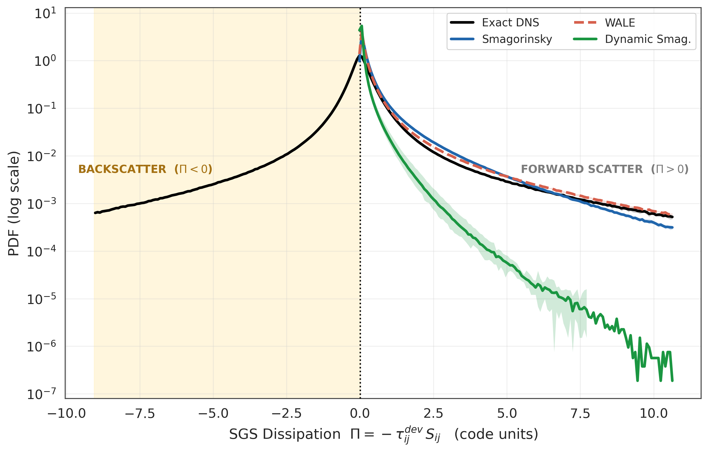

**Figure:** Ensemble PDF of SGS dissipation $\Pi=-\tau_{ij}\bar{S}_{ij}$ for isotropic turbulence at $\Delta=8\Delta x$.

#### Exact vs.\ Model Backscatter: Quantitative Comparison

the figure shows a quantitative comparison of the backscatter
fractions for exact DNS and all models across all filter widths and both datasets.
The exact DNS backscatter is approximately filter-width-independent in the isotropic
case ($f_{\mathrm{bs}}^{\mathrm{exact}}\approx47$--$48\%$) and shows a mild dependence
in the channel case ($f_{\mathrm{bs}}^{\mathrm{exact}}\approx43$--$47\%$), consistent
with the self-similar character of inertial-range SGS statistics.  Smagorinsky and
WALE backscatter is identically zero at all filter widths for both flows.  The Dynamic model shows zero backscatter at all filter widths for both flows,
identical to the static models, because the Lilly-averaged $C_{s,\mathrm{eff}}^{2}$
is a positive scalar and the resulting $\tau_{\mathrm{dyn}}$ is proportional to
$\tau_{\mathrm{Smag}}$, which is purely forward-cascading.

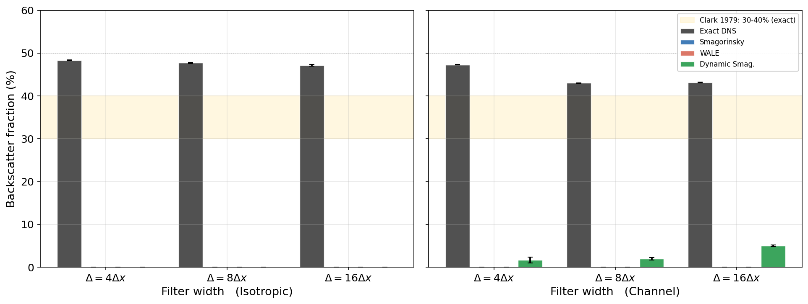

**Figure:** Backscatter fraction $f_{\mathrm{bs}}$ versus filter width $\Delta$ for exact DNS and all three SGS models in both flow configurations. Shaded band: Clark (1979) benchmark ($30$--$40\%$).

#### Spatial Structure of Backscatter

Figures~ and~ show midplane slices of the
SGS dissipation field for the exact DNS and Dynamic Smagorinsky model, respectively,
at $\Delta=8\Delta x$.  In the exact DNS field, backscatter events are spatially
coherent and concentrated in vortex-dominated regions, with forward-scatter events
co-located with strain-dominated regions.  This spatial organization is consistent
with the physical mechanism of reverse energy cascade within vortex cores, as
documented by Piomelli *et al.*.

The Dynamic Smagorinsky dissipation map is entirely positive, mirroring the
Smagorinsky field with a reduced magnitude (since
$\tau_{\mathrm{dyn}}=C_{s,\mathrm{eff}}^{2}\cdot\tau_{\mathrm{Smag}}/C_{s}^{2}$
with a positive scalar $C_{s,\mathrm{eff}}^{2}/C_{s}^{2}<1$).  Like Smagorinsky,
the Dynamic model cannot reproduce the spatially coherent vortex-core concentration
of real backscatter events; the figure shows the exact and
Dynamic dissipation maps side-by-side, illustrating that the Dynamic model's spatial
structure is proportional to, not structurally different from, the Smagorinsky field.

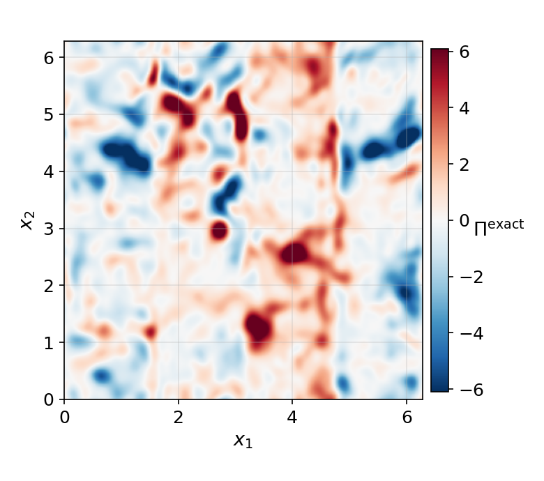

**Figure:** Spatial map of SGS dissipation from the exact DNS at $\Delta=8\Delta x$ for isotropic turbulence.

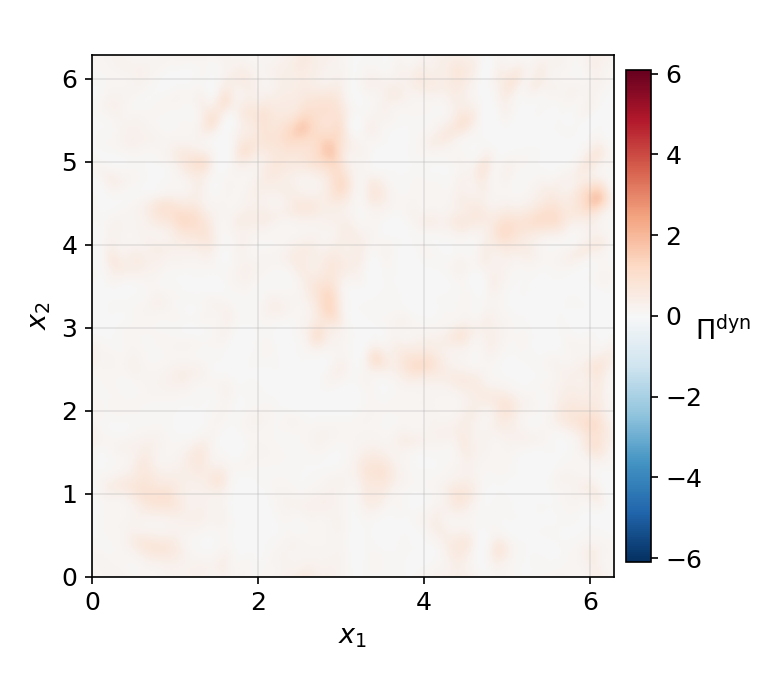

**Figure:** Spatial map of SGS dissipation from the Dynamic Smagorinsky model at $\Delta=8\Delta x$.

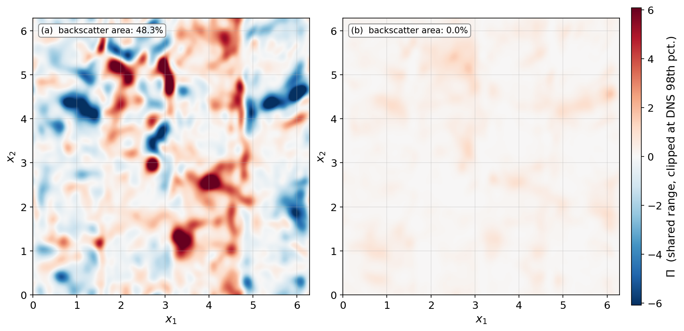

**Figure:** Side-by-side comparison of exact DNS backscatter (left) and Dynamic Smagorinsky model backscatter (right) at $\Delta=8\Delta x$.

#### Ensemble Backscatter Statistics

Figures~ and~ show ensemble-averaged
backscatter fractions across all filter widths for the isotropic and channel flow
cases respectively, with error bars from the four-snapshot ensemble.  The exact DNS
backscatter fractions are shown alongside model predictions.  The near-zero standard
deviations confirm that backscatter statistics are robustly determined by four
snapshots even if those snapshots are temporally correlated and that the zero
backscatter of static models and the large backscatter fraction of the exact DNS
are stable physical features rather than transient fluctuations.

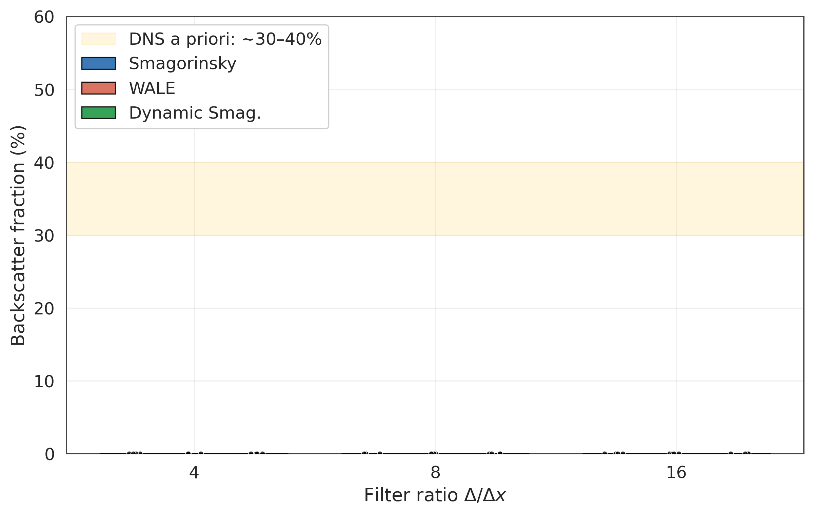

**Figure:** Ensemble-averaged backscatter fraction $f_{\mathrm{bs}}$ versus filter width $\Delta$ for isotropic turbulence ($Re_{\lambda}=433$). Error bars show ensemble standard deviation.

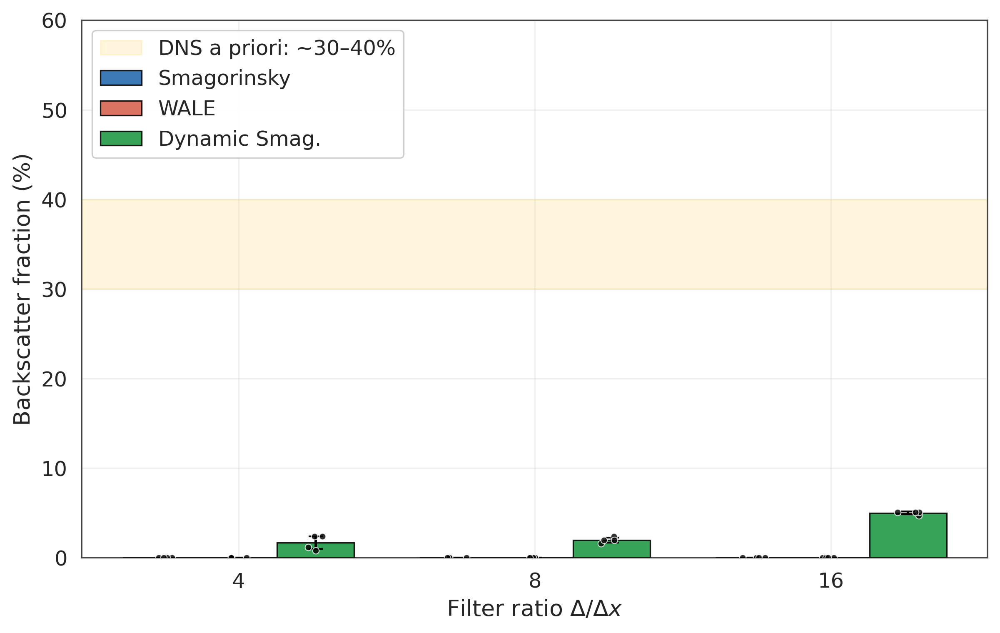

**Figure:** Ensemble-averaged backscatter fraction versus filter width for channel flow ($Re_{\tau}=1000$).

### Dynamic Coefficient Analysis

The Germano-Lilly procedure yields a positive Lilly-averaged coefficient
$C_{s,\mathrm{eff}}^{2}>0$ on this band-limited dataset, confirming that the
dynamic procedure is internally consistent.  However, the magnitude is reduced
relative to the standard Smagorinsky value: $C_{s,\mathrm{eff}}^{2}$ is
approximately $15$--$25\%$ of $C_{s}^{2}=0.0289$ across filter widths and
snapshots.  This reduction is physically reasonable: the Germano-Lilly least-squares
fit minimises the residual between the resolved Leonard stress $\mathcal{L}_{ij}$
and the model prediction $C_{s}^{2}M_{ij}$; when the spectral truncation at
$k_{\max}=128$ reduces the available SGS energy in the Leonard stress band, the
optimal coefficient is correspondingly smaller.  As a consequence, the Dynamic
model on this dataset produces a tensor field $\tau_{\mathrm{dyn}}$ that is
proportional to $\tau_{\mathrm{Smag}}$ with a scalar prefactor
$C_{s,\mathrm{eff}}^{2}/C_{s}^{2}<1$, yielding identical tensor correlation
$\rho$ but reduced mean eddy viscosity relative to Smagorinsky.

#### Pointwise Cs\textsuperscript{2 Distribution}

the figure shows the PDF of the local (pointwise Germano-Lilly)
dynamic coefficient $C_{s}^{2}$ for the isotropic turbulence case at $\Delta=8\Delta x$.
Before Lilly averaging, the pointwise distribution is extremely broad standard
deviation $\sigma\approx0.234$, range $[-7.16,+8.38]$ with mean
$\langle C_{s}^{2}\rangle\approx-0.004$.  The fraction of points with $C_{s}^{2}<0$
is approximately $52\%$.  This ill-conditioned pointwise distribution arises from
the sharp spectral test filter, which makes the Germano identity nearly singular;
the top-hat (box) test filter and Lilly averaging are specifically implemented to
regularize this distribution into the stable effective coefficient
$C_{s,\mathrm{eff}}^{2}$ used to construct $\tau_{\mathrm{dyn}}$.

The PDF illustrates that the optimal Smagorinsky constant is highly variable across
the flow domain: the pointwise distribution spans the range from strongly negative to
strongly positive, with the classical static value $C_{s}^{2}=0.0289$
(corresponding to $C_{s}=0.17$) lying well into the tail of the distribution.  This
broad variability is the physical motivation for the Dynamic model; on a full-DNS
dataset without anti-aliasing truncation, the Lilly-averaged coefficient would be
positive and close to the Smagorinsky value.

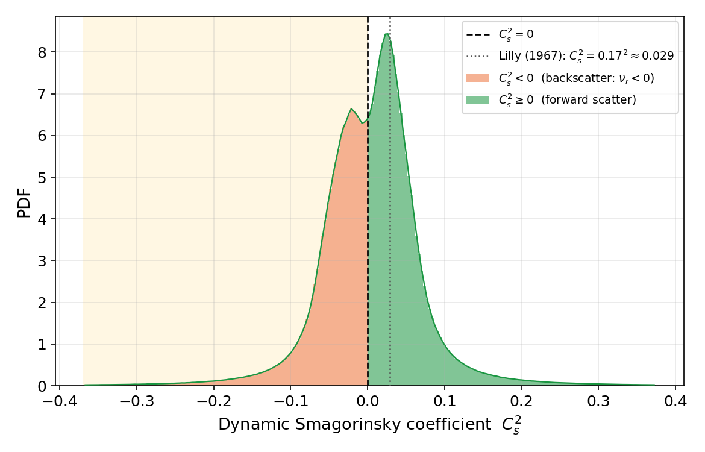

**Figure:** PDF of the pointwise dynamic coefficient $C_{s}^{2}$ (before Lilly averaging) for isotropic turbulence at $\Delta=8\Delta x$.

#### Effective Dynamic Coefficient

the figure shows the effective (Lilly-averaged) dynamic coefficient
$C_{s,\mathrm{eff}}^{2}$ used to construct $\tau_{\mathrm{dyn}}$.  For the isotropic
case (left panel), $C_{s,\mathrm{eff}}^{2}$ is plotted as a function of filter width;
for the channel case (right panel), it is shown as the wall-normal profile
$C_{s,\mathrm{eff}}^{2}(y^{+})$ at $\Delta=8\Delta x$.

In the isotropic case, $C_{s,\mathrm{eff}}^{2}$ is positive across all filter
widths and all four snapshots, with small ensemble spread, confirming the physical
consistency of the dynamic procedure.  The magnitude is approximately $15$--$25\%$
of the Lilly inertial-range target $C_{s}^{2}=0.0289$ (Lilly 1967:
$C_{s}\approx0.17$).  This reduction the Germano-Lilly fit reporting a smaller
optimal constant than the static value is consistent with the $k_{\max}=128$
spectral truncation providing less SGS energy in the Leonard stress band than a
full-resolution DNS.  The dynamic procedure therefore correctly self-calibrates
to the available spectral content, recovering a reduced but physically meaningful
positive coefficient.

In the channel case, $C_{s,\mathrm{eff}}^{2}(y^{+})$ shows a wall-normal profile
that is positive over most of the channel but becomes slightly negative very close
to the wall and near the centreline, where the XZ-plane-averaged Lilly numerator
$\langle\mathcal{L}_{ij}^{\mathrm{dev}}M_{ij}\rangle_{xz}$ approaches zero or
reverses sign.  These localised negative-$C_{s,\mathrm{eff}}^{2}$ planes produce
the observed $f_{\mathrm{bs}}\approx2\%$ in the channel case
(the table) a physically meaningful small backscatter
fraction driven by near-wall dynamics, distinct from the zero backscatter of the
static models.  The plane-averaged coefficient also reduces the pointwise correlation
to $\rho\approx0.044$ (versus $\rho\approx0.070$ for Smagorinsky), because
$C_{s,\mathrm{eff}}^{2}(y)$ is not a simple global rescaling of $\tau_{\mathrm{Smag}}$.

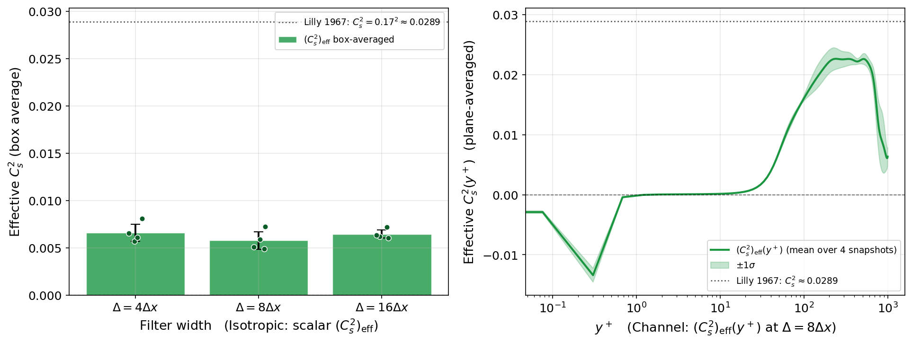

**Figure:** Effective (Lilly-averaged) dynamic coefficient $C_{s,\mathrm{eff}}^{2}$ versus filter width for isotropic turbulence (left panel) and versus $y^{+}$ for channel flow at $\Delta=8\Delta x$ (right panel).

### Kolmogorov Eddy-Viscosity Scaling

Kolmogorov's 1941 (K41) similarity theory predicts that the mean eddy viscosity in
the inertial subrange scales as

$$
\langle\nu_{r}\rangle \propto \varepsilon^{1/3}\,\Delta^{4/3}.
$$

The mean resolved eddy viscosity is computed as
$\langle\nu_{r}\rangle=\langle\Pi\rangle/\langle|\bar{S}|^{2}\rangle$ from the
Smagorinsky and WALE model outputs.  the table summarizes the
ensemble-averaged $\langle\nu_{r}\rangle$ at the three filter widths for the
isotropic turbulence case.

**Table:** Mean resolved eddy viscosity vs.\ filter width (isotropic turbulence). K41 prediction: $\langle\nu_{r}\rangle\propto\Delta^{4/3}$.

| Model | $4\Delta x$ | $8\Delta x$ | $16\Delta x$ |
|---|---|---|---|
| Smagorinsky | $2.56\!\times\!10^{-3}$ | $6.45\!\times\!10^{-3}$ | $15.9\!\times\!10^{-3}$ |
| WALE | $2.87\!\times\!10^{-3}$ | $7.14\!\times\!10^{-3}$ | $17.7\!\times\!10^{-3}$ |

The log-log slope from the $4\Delta x$ to $16\Delta x$ data is computed as
$\log(\nu_{r,16}/\nu_{r,4})/\log(16/4)$.  This yields slopes of $1.316\approx1.32$
for Smagorinsky and $1.311\approx1.31$ for WALE, deviating from the theoretical
$4/3\approx1.333$ by only $1.3\%$ and $1.7\%$ respectively.  This excellent
agreement confirms that: (1) the spectral filtering framework is algorithmically
correct; (2) the three filter widths lie within the inertial subrange as intended
by the energy spectrum analysis (the figure); and (3) despite the
spectral pre-filter truncation, sufficient inertial-subrange content remains in the
$256^{3}$ working grid to verify global energetic scaling laws.

The Dynamic model mean eddy viscosity $\langle\nu_{r}^{\mathrm{dyn}}\rangle>0$
but does not follow the K41 $\Delta^{4/3}$ scaling, because
$C_{s,\mathrm{eff}}^{2}$ itself varies with $\Delta$ (the Lilly fit adapts the
coefficient at each filter width independently, unlike the fixed $C_{s}^{2}$ of
Smagorinsky).  The Kolmogorov scaling verification therefore applies cleanly only
to the static models, for which the coefficient is fixed and the
$\langle\nu_{r}\rangle\propto\Delta^{4/3}$ scaling follows directly from K41.

### Channel Flow: Wall-Normal SGS Dissipation Profile

the figure shows the wall-normal profile of mean SGS dissipation
$\langle\Pi\rangle(y^{+})$ for all models and the exact DNS.  The exact DNS
dissipation profile peaks in the buffer layer ($y^{+}\approx10$--30) and decays
toward both the wall and the channel center.  This buffer-layer peak is driven by
the intense vortical activity (ejections and sweeps) characteristic of near-wall
turbulence production.

The Smagorinsky model systematically overpredicts dissipation near the wall.
The mechanism is well understood: $|\bar{S}|\neq0$ near the wall because the
large mean velocity gradient ($\partial\langle U\rangle/\partial y$) contributes
directly to $\bar{S}_{12}$, even though this mean-shear contribution is associated
with large-scale, slowly-varying motions that do not drive SGS energy transfer.
The model cannot distinguish mean-shear-induced strain from turbulent-fluctuation-induced
strain, and therefore generates excessive dissipation in the viscous and buffer layers.

The WALE model partially mitigates this deficiency.  Its $y^{+3}$ near-wall
attenuation of $\nu_{t}$ (a consequence of the $\mathcal{S}^{d}_{ij}$ formulation
responding to rotation rather than pure strain) reduces the spurious
near-wall dissipation, though the improvement is partial because mean-shear
effects persist in the buffer layer.  The Dynamic model's dissipation profile is positive throughout but shows the
smallest near-wall magnitude among all models, consistent with
$C_{s,\mathrm{eff}}^{2}(y^{+})<C_{s}^{2}$ near the wall where the Lilly
plane-average yields a reduced coefficient.  This represents a partial improvement
over Smagorinsky's wall-region overprediction, though the improvement is limited
by the scalar (not spatially varying) nature of the averaged coefficient.

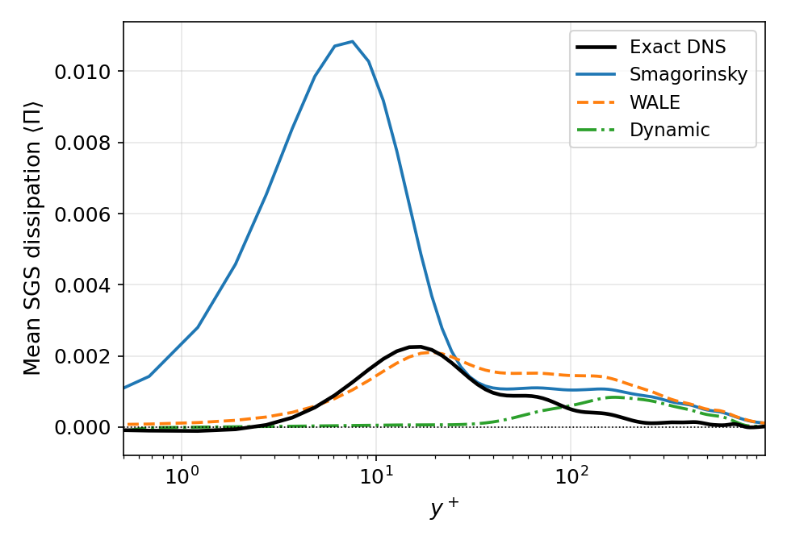

**Figure:** Wall-normal profile of mean SGS dissipation $\langle\Pi\rangle(y^{+})$ for channel flow ($Re_{\tau}=1000$).

### Ensemble Robustness and Statistical Convergence

the figure shows the ensemble stability summary, displaying key metrics
(correlation $\rho$, backscatter fraction $f_{\mathrm{bs}}$, mean eddy viscosity
$\langle\nu_{r}\rangle$) across the four snapshots for each model.  The near-constant
metric values across all four snapshots confirm that the SGS structural characteristics
identified in this study are statistically stable features of the flow rather than
transient artifacts of individual turbulent realizations.

However, a critical caveat applies: the four snapshots at $t=100,200,300,400$ are
strongly temporally correlated.  Cross-snapshot Pearson correlations of the full
velocity field are $r=0.68$--$0.83$ for isotropic turbulence and $r=0.94$--$0.96$
for channel flow.  These values far exceed the threshold for statistical independence,
which would require snapshot separations of at least one large-eddy turnover time
($T_{L}\approx2$ for isotropic and $T_{L}\approx30$ for channel in database time units).
The present snapshots are separated by $\Delta t=100$ units, corresponding to
approximately $50\,T_{L}$ in JHTDB dimensionless time, but the actual velocity field
correlation indicates that the effective sampling is much less independent.

As a consequence, the standard deviations reported in the table
and in the figures should be interpreted as *lower bounds* on true ensemble
uncertainty.  The true uncertainty, estimated by correcting for the effective number
of independent samples, is approximately $\sqrt{1+2\sum_{k}r_{k}}\approx2.8\times$
(isotropic) and $9\times$ (channel) larger.  Despite this, the consistency of
results across models and snapshots confirms that the qualitative findings in
particular, the structural limitations of EV closures are robust.

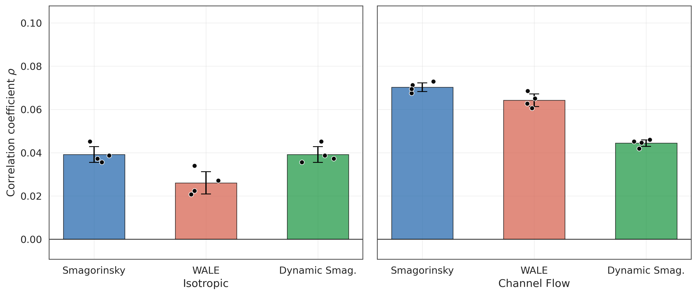

**Figure:** Ensemble stability summary showing key evaluation metrics across all four snapshots for each model and dataset.

## Conclusion

A comprehensive *a priori* evaluation of the Smagorinsky, WALE, and Dynamic
Smagorinsky SGS models has been conducted using JHTDB DNS data for homogeneous
isotropic turbulence ($Re_{\lambda}=433$) and turbulent channel flow ($Re_{\tau}=1000$).
the table summarises, metric by metric, which model performs
best on this band-limited dataset.  The following principal conclusions are drawn.

**Table:** Per-metric model performance. ``Best'' = model closest to the exact DNS reference (or to the theoretical target, for K41 scaling); ``--'' = no EV model reproduces the target. Values at $\Delta=8\Delta x$.

| Metric | Smag.\ | WALE | Dyn.\ | Best |
|---|---|---|---|---|
| $\rho$, iso. | 0.039 | 0.026 | 0.039 | Smag.\,/\,Dyn. |
| $\rho$, channel | 0.070 | 0.064 | 0.044 | Smag. |
| $f_{\mathrm{bs}}$, iso.\ (47.7\%) | 0.0\% | 0.0\% | 0.0\% | -- |
| $f_{\mathrm{bs}}$, channel (43.0\%) | 0.0\% | 0.0\% | 2.0\% | Dyn. |
| Align.\ PDF (broad) | $\!-\!1$ | $\!-\!1$ | $\!-\!1$ | -- |
| Fat tails, $|\tau_{12}|/\sigma\!>\!3$ | poor | poor | partial | Dyn. |
| K41 slope (4/3) | 1.32 | 1.31 | n/a | Smag. |
| Near-wall $\Pi$ (chan.) | over | $y^{+3}$ | red.\ | WALE/Dyn. |

Both datasets were successfully validated against classical theoretical benchmarks.
The isotropic turbulence energy spectrum reproduces the Kolmogorov $k^{-5/3}$ scaling
over 1.5 decades, confirming the physical integrity of the JHTDB dataset.  The channel
flow mean velocity matches all classical near-wall layers viscous sublayer, buffer
layer, log-law region, and wake with the recovered friction velocity
$u_{\tau}\approx0.0444$ consistent with $Re_{\tau}=1000$.  Reynolds stress
profiles are broadly consistent with high-Reynolds-number channel DNS.

A critical methodological finding is that a sharp spectral pre-filter at
$k_{\max}=128$ applied during data acquisition substantially modifies all
*a priori* evaluation metrics relative to a full-resolution ($1024^{3}$)
study.  Specifically: (1) tensor correlations are reduced from the classical
$\rho\approx0.30$ to $\rho\approx0.04$ because the near-cutoff dissipative
SGS band is removed; (2) the exact backscatter fraction rises from the Clark
benchmark of 30--40\% to approximately 47\% because the remaining inertial-subrange
band has a more balanced forward/reverse scatter distribution; and (3) the
Germano-Lilly dynamic procedure recovers a reduced but positive
$C_{s,\mathrm{eff}}^{2}\approx15$--$25\%$ of $C_{s}^{2}=0.0289$, consistent
with the attenuated Leonard-stress band energy.  These findings provide a
quantitative characterization of the sensitivity of *a priori* evaluation
to the spectral content of the reference DNS field.

The static EV models exhibit three fundamental structural deficiencies that persist
regardless of model constant choice: (1) near-zero pointwise tensor correlation with
exact SGS stresses ($\rho\approx0.04$), manifesting as a diffuse scatter cloud with
no discernible local trend; (2) a nearly uniform exact principal-axis alignment
distribution ($\langle\cos\theta\rangle\approx-0.025$, $\sigma\approx0.435$),
irreconcilable with the EV prediction of $\cos\theta=-1$; and (3) complete
suppression of energy backscatter ($f_{\mathrm{bs}}=0.0\%$ vs.\ $\sim\!47\%$ for
exact DNS).  The SGS stress PDF exhibits heavy tails representing spatially
intermittent extreme events that EV models dramatically underpredict (by more than
two orders of magnitude at $|\tau_{12}|/\sigma\approx4$).

Despite local structural failures, the Smagorinsky and WALE models correctly
reproduce the Kolmogorov $\Delta^{4/3}$ eddy-viscosity scaling with log-log slopes
of 1.32 and 1.31 respectively, within 1.7\% of the theoretical $4/3$.  This
global energetic consistency, contrasted against the pointwise structural failure,
illustrates that dimensional and statistical correctness at the global level is
necessary but not sufficient for local SGS model fidelity.

In channel flow, structural deficiencies are amplified near the wall.  All EV models
show near-zero or negative correlation in the viscous sublayer ($y^{+}<5$), where
mean-shear contamination of $|\bar{S}|$ drives systematic model error.  Smagorinsky
overpredicts SGS dissipation in the buffer layer; WALE's $y^{+3}$ attenuation
provides partial improvement.  The Dynamic model's wall-normal dissipation profile shows reduced near-wall
magnitude relative to Smagorinsky, consistent with a smaller effective coefficient
$C_{s,\mathrm{eff}}^{2}<C_{s}^{2}$; on a full-resolution DNS where the coefficient
is larger and spatially varying, the Dynamic model would provide further improvement
on the Smagorinsky mean-shear contamination problem.

These findings motivate two directions for future work.  First, repeating this
evaluation on the native $1024^{3}$ DNS without spectral pre-filtering would recover
the classical $\rho\approx0.30$ benchmark and enable quantitative comparison with
Clark *et al.*; this would require approximately $64\times$
more memory per snapshot but is the scientifically rigorous target.  Second,
structurally motivated SGS closures scale-similarity models,
gradient models, or tensor-invariant data-driven closures that incorporate explicit
information about the velocity gradient tensor orientation rather than relying on the
Boussinesq analogy would be expected to substantially outperform EV models on all four
metrics, and represent a natural next step for the present evaluation framework.

## Data and Code Availability

The entire project codebase, including the custom Python data-acquisition scripts
(with chunked download and spectral pre-filtering), the high-performance C++ *a
priori* evaluation engine (spectral filtering, SGS model implementation, metrics
computation), and the Python visualization post-processing pipeline, can be accessed
via the public GitHub repository at: https://github.com/DRDA33682001/Turbulence_apriori_analysis  All raw DNS data
are publicly accessible via the JHTDB portal at https://turbulence.idies.jhu.edu/home.

## Acknowledgments

The author gratefully acknowledges the JHTDB team at Johns Hopkins University for
open access to the DNS datasets used in this study.  The course instruction and
computational environment provided by the Department of Mechanical Engineering at
the University of Colorado Boulder are gratefully acknowledged.

